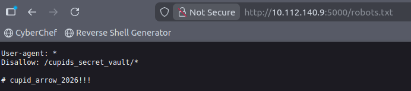
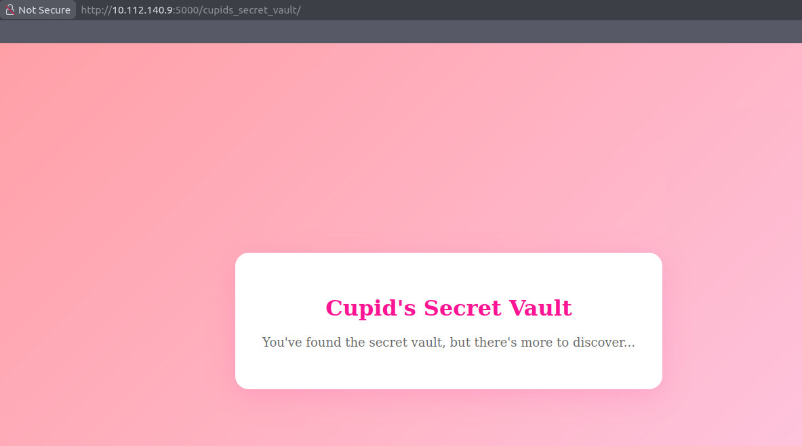
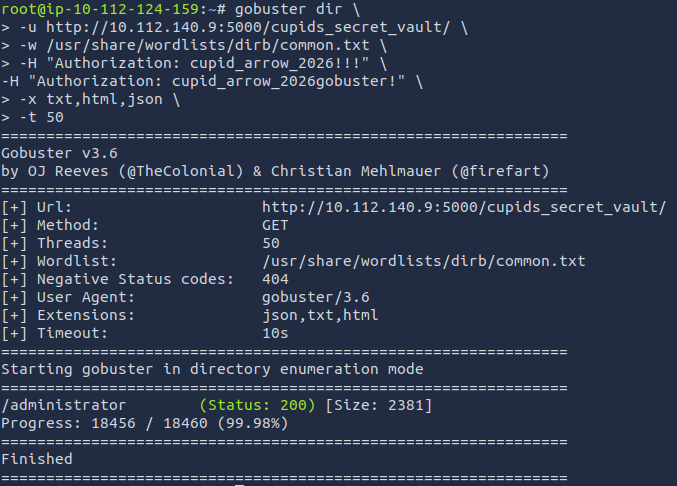
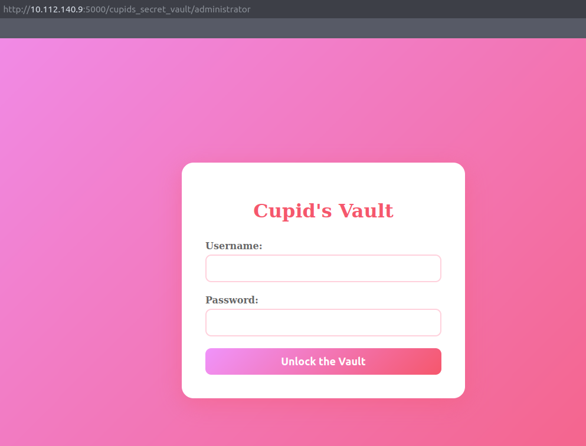
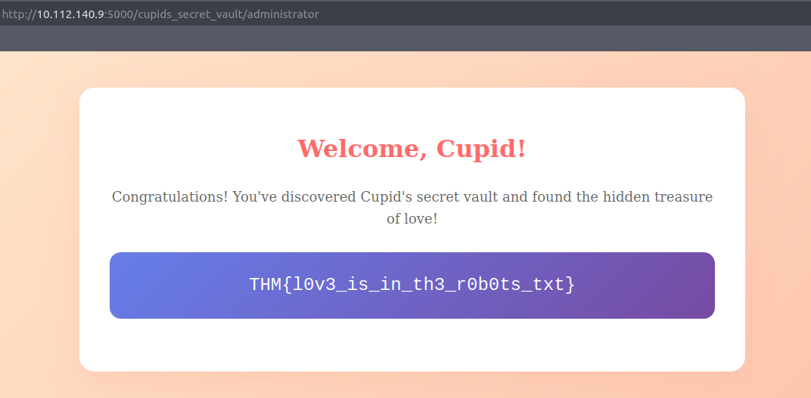

### Hidden Deep Into my Heart

## Description

Cupid's Vault was designed to protect secrets meant to stay hidden forever. Unfortunately, Cupid underestimated how determined attackers can be.
Intelligence indicates that Cupid may have unintentionally left vulnerabilities in the system. With the holiday deadline approaching, you've been tasked with uncovering what's hidden inside the vault before it's too late.
You can find the web application here: http://10.112.140.9:5000

## Solution

The site does not show any input field


Searching for any information i finally found something in /robots.txt file



This file shows me another section of the site to analyze

```
/cupids_secret_vault/
```

and also has something like a password

```
cupid_arrow_2026!!!
```

the new page is another page without any input field, but it says that we have more to discover...



At this point i start gobuster in order to enumerate any other section of the site

```
gobuster dir \
-u http://10.112.140.9:5000/cupids_secret_vault/ \
-w /usr/share/wordlists/dirb/common.txt \
-H "Authorization: cupid_arrow_2026!!!" \
-x txt,html,json \
-t 50
```



And i found /administrator



Finally a login page, and probably it's an administration page

so let's try to use the previous password
```
Admin
```
```
cupid_arrow_2026!!!
```

and here we have the flag


